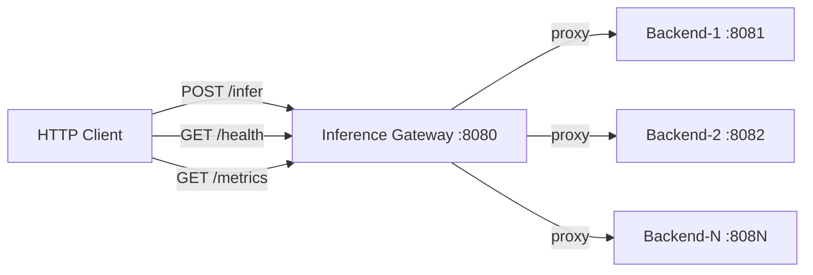
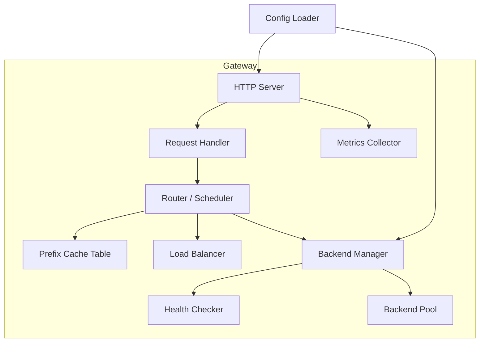
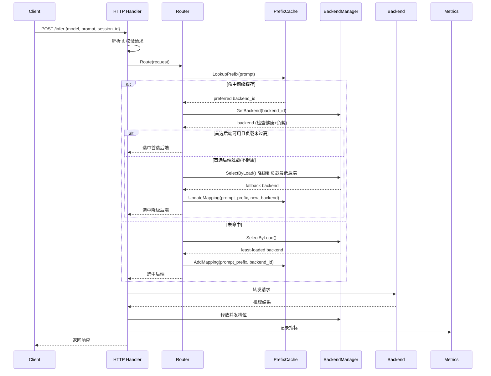

# 推理网关（Inference Gateway）系统架构设计

## 1. 架构总览

### 1.1 系统上下文



### 1.2 内部模块关系



### 1.3 单请求生命周期



---

## 2. 目录结构设计

```
inferencegateway/
├── cmd/
│   ├── gateway/          # 网关主进程入口
│   │   └── main.go
│   └── mockbackend/      # Mock 后端服务入口
│       └── main.go
├── internal/
│   ├── config/           # 配置加载与定义
│   │   ├── config.go
│   │   └── config_test.go
│   ├── server/           # HTTP 服务器和 handler
│   │   ├── server.go
│   │   ├── handler.go
│   │   └── handler_test.go
│   ├── router/           # 路由策略核心
│   │   ├── router.go         # Router 接口 + 混合路由实现
│   │   ├── prefix_cache.go   # 前缀缓存表
│   │   ├── loadbalancer.go   # 负载均衡策略
│   │   └── router_test.go
│   ├── backend/          # 后端管理
│   │   ├── manager.go        # BackendManager
│   │   ├── backend.go        # Backend 实体
│   │   ├── healthcheck.go    # 健康检查
│   │   └── manager_test.go
│   └── metrics/          # 可观测性
│       ├── metrics.go
│       └── metrics_test.go
├── configs/
│   └── gateway.yaml      # 默认配置文件
├── docs/
│   └── architecture.md   # 本文档
├── go.mod
└── go.sum
```

---

## 3. 核心数据结构

```go
// === 配置 ===

type GatewayConfig struct {
    ListenAddr string          `yaml:"listen_addr"` // ":8080"
    Backends   []BackendConfig `yaml:"backends"`
    Router     RouterConfig    `yaml:"router"`
}

type BackendConfig struct {
    ID             string `yaml:"id"`
    Address        string `yaml:"address"`
    MaxConcurrency int    `yaml:"max_concurrency"`
}

type RouterConfig struct {
    Strategy             string  `yaml:"strategy"`               // "prefix", "load", "hybrid"
    PrefixMinLength      int     `yaml:"prefix_min_length"`      // 前缀匹配最小字符数, 默认 4
    LoadThresholdPercent float64 `yaml:"load_threshold_percent"`  // 混合策略: 超过此比例则降级, 默认 0.8
    PrefixCacheMaxSize   int     `yaml:"prefix_cache_max_size"`  // 前缀缓存表最大条目数
}

// === 请求/响应 ===

type InferRequest struct {
    Model     string `json:"model"`
    Prompt    string `json:"prompt"`
    SessionID string `json:"session_id,omitempty"`
}

type InferResponse struct {
    RequestID string `json:"request_id"`
    BackendID string `json:"backend_id"`
    Result    string `json:"result"`
    Latency   int64  `json:"latency_ms"`
    CacheHit  bool   `json:"cache_hit"`
}

// === 后端运行时状态 ===

type Backend struct {
    ID             string
    Address        string
    MaxConcurrency int
    // 运行时 (需并发安全)
    activeConcurrency atomic.Int32
    healthy           atomic.Bool
    avgLatencyMs      atomic.Int64  // 进阶: 滑动窗口平均响应时间
}
```

---

## 4. 核心接口定义

### 4.1 Router（路由器）

```go
// Router 根据请求内容和后端状态选择目标后端
type Router interface {
    // Route 为给定请求选择最合适的后端
    // 返回选中的 Backend 和是否命中前缀缓存
    Route(ctx context.Context, req *InferRequest) (backend *Backend, cacheHit bool, err error)
}
```

### 4.2 BackendManager（后端管理器）

```go
// BackendManager 管理所有后端实例的生命周期和状态
type BackendManager interface {
    // GetBackend 根据 ID 获取后端; 返回 nil 表示不存在或不健康
    GetBackend(id string) *Backend

    // HealthyBackends 返回当前所有健康的后端列表
    HealthyBackends() []*Backend

    // AcquireSlot 尝试获取后端的一个并发槽位
    // 返回 false 表示该后端已到达最大并发
    AcquireSlot(backendID string) bool

    // ReleaseSlot 释放后端的一个并发槽位
    ReleaseSlot(backendID string)

    // Start 启动健康检查循环
    Start(ctx context.Context)
}
```

### 4.3 PrefixCache（前缀缓存表）

```go
// PrefixCache 维护 prompt 前缀到后端的映射
type PrefixCache interface {
    // Lookup 查找与 prompt 最长匹配的前缀，返回关联的后端 ID
    // found=false 表示无匹配
    Lookup(prompt string) (backendID string, found bool)

    // Put 记录一个前缀到后端的映射
    Put(prefix string, backendID string)

    // Remove 删除指定前缀的映射
    Remove(prefix string)
}
```

### 4.4 HealthChecker（健康检查）

```go
// HealthChecker 定期探测后端健康状态
type HealthChecker interface {
    // Start 开始定期健康检查，通过 ctx 取消
    Start(ctx context.Context, backends []*Backend)
}
```

### 4.5 MetricsCollector（指标收集）

```go
// MetricsCollector 收集和暴露 Prometheus 指标
type MetricsCollector interface {
    RecordRequest(backendID string, latencyMs int64, cacheHit bool, err error)
    Handler() http.Handler // 返回 /metrics 的 HTTP handler
}
```

---

## 5. 路由调度算法设计

### 5.1 策略1：Prefix Cache 感知路由

**核心思路**：维护一个 `prefix → backend_id` 的映射表。用 prompt 去匹配最长前缀，路由到对应后端。

**前缀提取**：取 prompt 的前 N 个字符（`prefix_min_length` 配置，默认4字符），然后再做变长匹配。

**数据结构选型**：

| 方案 | 优缺点 |
|------|--------|
| `map[string]string` | 简单，O(1) 精确匹配。需要多次截断 prompt 做查找 |
| Trie 树 | 最长前缀匹配天然支持，但实现复杂 |

**选择**：先用 **map + 逐步截断查找**（从完整 prompt 往短截，每次缩短一定步长）。已足够满足题目 "字符串前缀" 的简化假设。后续可替换为 Trie。

```
查找过程:
  for length = len(prompt); length >= minPrefixLen; length -= step:
      if backendID, ok := cache[prompt[:length]]; ok:
          return backendID
  return NOT_FOUND
```

**淘汰**：LRU 策略。当条目数超过 `prefix_cache_max_size` 时淘汰最久未访问的。

### 5.2 策略2：负载均衡

**算法**：加权最小连接数（Weighted Least Connections）

```
score(backend) = active_concurrency / max_concurrency
选择 score 最小的健康后端
```

满载（`active_concurrency >= max_concurrency`）的后端直接跳过。

### 5.3 策略3：混合策略（推荐默认）

```
func HybridRoute(req):
    preferred = PrefixCache.Lookup(req.prompt)
    if preferred != nil && preferred.healthy:
        loadRatio = preferred.activeConcurrency / preferred.maxConcurrency
        if loadRatio < loadThresholdPercent:   // 默认 0.8
            return preferred                   // 缓存命中 + 负载 OK
    // 降级到负载均衡
    fallback = LeastLoadedBackend()
    PrefixCache.Put(extractPrefix(req.prompt), fallback.ID)
    return fallback
```

**权衡参数**：`load_threshold_percent`
- 设大（如 0.95）→ 更激进复用缓存，命中率高但易过载
- 设小（如 0.5）→ 更激进负载均衡，过载风险低但缓存利用差

---

## 6. 并发模型

### 6.1 Goroutine 职责划分

| Goroutine | 生命周期 | 职责 |
|-----------|----------|------|
| main goroutine | 进程级 | 加载配置、初始化所有组件、启动 HTTP server |
| HTTP handler goroutine | 每请求 | `net/http` 默认为每个连接创建 goroutine |
| 健康检查 goroutine | 进程级 | 每 N 秒遍历所有后端执行 HTTP GET /health |
| 指标聚合（可选） | 进程级 | 定期对 Prometheus Counter/Histogram 做 flush |

### 6.2 共享状态与同步

| 共享状态 | 访问模式 | 同步机制 |
|----------|----------|----------|
| `Backend.activeConcurrency` | 高频读写 | `atomic.Int32` |
| `Backend.healthy` | 低频写，高频读 | `atomic.Bool` |
| Prefix Cache 映射表 | 高频读，中频写 | `sync.RWMutex` |
| Backend 列表 | 启动时写，运行时只读 | 启动时初始化，不需锁 |

### 6.3 优雅关闭

```
收到 SIGTERM/SIGINT
  → ctx cancel
  → HTTP Server.Shutdown(ctx) —— 等待存量请求完成
  → 健康检查 goroutine 退出
  → 清理资源
```

---

## 7. 分阶段实施计划

### Phase 0: 项目初始化
| 任务 | 内容 | 验收标准 |
|------|------|----------|
| T0.1 | `go mod init`，创建目录结构 | 项目可 `go build` 无报错 |
| T0.2 | 定义配置结构体 + YAML 加载 | 能读取 `configs/gateway.yaml` 并反序列化 |

### Phase 1: Mock 后端
| 任务 | 内容 | 验收标准 |
|------|------|----------|
| T1.1 | 实现 `cmd/mockbackend/main.go` | 提供 `POST /infer` 和 `GET /health`；模拟延迟（100-500ms 随机）；支持启动多个实例（不同端口） |

### Phase 2: 网关骨架 + 简单转发
| 任务 | 内容 | 验收标准 |
|------|------|----------|
| T2.1 | 实现 HTTP Server + `POST /infer` handler | 请求能被网关接收并返回响应 |
| T2.2 | 实现 BackendManager（无健康检查） | 能管理后端列表，AcquireSlot/ReleaseSlot 正确 |
| T2.3 | 实现轮询路由（Round Robin） | 请求能均匀分发到各后端（作为 baseline） |
| **验收** | 启动 2 个 mock 后端 + 网关，curl 发送请求能正确返回 | |

### Phase 3: 智能路由
| 任务 | 内容 | 验收标准 |
|------|------|----------|
| T3.1 | 实现 PrefixCache（map + LRU） | 单元测试：Lookup/Put/Remove/LRU淘汰 |
| T3.2 | 实现 Prefix 感知路由策略 | 相同前缀请求路由到同一后端 |
| T3.3 | 实现加权最小连接数负载均衡 | 请求分发到负载最低后端 |
| T3.4 | 实现混合路由策略 | 前缀首选 + 过载降级；`load_threshold_percent` 可配 |
| **验收** | 题目中4个示例场景全部通过 | |

### Phase 4: 健康检查
| 任务 | 内容 | 验收标准 |
|------|------|----------|
| T4.1 | 实现 HealthChecker | 定期检测，不健康后端自动剔除，恢复后自动加回 |
| T4.2 | 集成到 BackendManager | 路由不会选到不健康后端 |
| **验收** | 停掉一个 mock 后端，请求自动切走；重启后自动恢复 | |

### Phase 5: 可观测性（进阶）
| 任务 | 内容 | 验收标准 |
|------|------|----------|
| T5.1 | 集成 Prometheus client | `GET /metrics` 返回标准格式 |
| T5.2 | 埋点：请求计数、延迟直方图、缓存命中率、错误率 | Prometheus 能 scrape 并查询 |

### Phase 6: 进阶特性（选做）
| 任务 | 内容 |
|------|------|
| T6.1 | 动态权重：根据响应时间滑动窗口调整 |
| T6.2 | 请求排队：所有后端满载时排队等待，超时返回 503 |
| T6.3 | 优雅关闭：SIGTERM → drain 存量请求 |

---

## 8. 关键设计决策记录

| 决策 | 选项 | 选择 | 理由 |
|------|------|------|------|
| 前缀匹配方式 | Trie / Map截断 | Map截断 | 满足简化假设，实现简单，后续可替换 |
| HTTP 框架 | net/http / gin / chi | net/http (标准库) | 题目推荐轻量级，减少依赖 |
| 配置格式 | JSON / YAML / TOML | YAML | 与题目示例一致 |
| 并发计数 | Mutex+int / atomic | atomic.Int32 | 高频操作，无锁更好 |
| 前缀缓存并发 | sync.Map / RWMutex+map | RWMutex+map | LRU 需要维护访问顺序，sync.Map 不适合 |
| 负载均衡算法 | RR / WRR / WLC | WLC (加权最小连接) | 考虑当前负载，更适合推理场景 |

---

## 9. 依赖管理

| 依赖 | 用途 | 备注 |
|------|------|------|
| `gopkg.in/yaml.v3` | YAML 配置解析 | 标准选择 |
| `github.com/prometheus/client_golang` | Prometheus 指标 | Phase 5 引入 |
| 标准库 `net/http`, `sync`, `sync/atomic`, `context`, `log/slog` | 核心功能 | 无额外依赖 |
